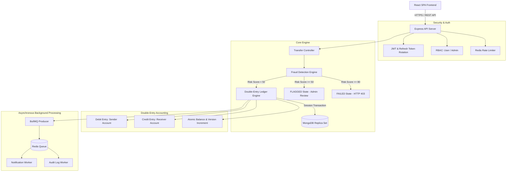

# Distributed Payment Ledger System

Production-grade, highly available, fault-tolerant monetary transaction and double-entry accounting engine built with Node.js, Express, MongoDB (ACID Replica Set), Redis, BullMQ, and React (Vite & Tailwind/Glassmorphic UI).

[](https.mit-license.org)
[]()
[]()

---

## 🏛️ System Architecture

The architecture strictly enforces double-entry accounting invariants, ACID multi-document MongoDB transactions, rule-based risk evaluation, and asynchronous side-effect processing.



---

## 🔒 Accounting Invariants & Principles

1. **Double-Entry Principle**: Every successfully completed transfer creates **exactly one DEBIT entry** and **exactly one CREDIT entry**. Total debits MUST equal total credits ($\sum \text{Debits} = \sum \text{Credits}$).
2. **Minor Unit Integer Monetary System**: All monetary amounts are stored and processed strictly as minor unit integers (paise/cents, e.g. 50000 = ₹500.00). Floating-point arithmetic is strictly prohibited to prevent rounding drift.
3. **Idempotency Protection**: Every transfer request accepts an `Idempotency-Key` header. Duplicate request keys within a 24-hour TTL window return the cached response without re-executing transactions.
4. **ACID Transactions & Optimistic Concurrency**: All ledger postings run within MongoDB multi-document transactions using session commit/rollback and `Account.version` optimistic locking.
5. **Pre-Ledger Fraud Evaluation**: Risk rule evaluation runs BEFORE ledger execution. High-risk transactions transition to `FLAGGED` (held for admin approval) or `BLOCKED`.
6. **Public Role Hardening**: Public user registration (`POST /api/v1/auth/register`) strictly forces `role = 'user'`, completely ignoring client-supplied role parameters to eliminate privilege escalation vulnerabilities.

---

## 🔐 Admin Account Promotion

Public endpoints do not allow admin account creation. To promote a user to an `admin` role, execute the following command in MongoDB:

```bash
docker exec -it payment_ledger_mongo mongosh payment_ledger --eval 'db.users.updateOne({ email: "admin@example.com" }, { $set: { role: "admin" } })'
```

---

## 🚀 Technology Stack

* **Backend**: Node.js (ESM), Express.js, Mongoose 8, Pino Logger, Helmet, CORS, Rate-Limiter-Flexible.
* **Frontend**: React 18, Vite 5, React Router v6, Axios, Lucide Icons, Custom Glassmorphism CSS.
* **Databases**: MongoDB (Replica Set `rs0` for multi-document ACID transactions), Redis 7 (Caching, Rate Limiting, BullMQ queues).
* **Workers**: BullMQ 5.
* **Testing & Linting**: Jest 29, Supertest, Vitest, ESLint 8.

---

## 📋 API Reference Summary

| Endpoint | Method | Role | Description |
| :--- | :--- | :--- | :--- |
| `/api/v1/auth/register` | `POST` | Public | Register new user & initialize wallet account (forces `role = 'user'`) |
| `/api/v1/auth/login` | `POST` | Public | Authenticate user & return Access + Refresh JWTs |
| `/api/v1/auth/refresh` | `POST` | Public | Rotate refresh token & issue new JWT pair |
| `/api/v1/auth/logout` | `POST` | User | Invalidate user refresh token session |
| `/api/v1/accounts/me` | `GET` | User | Retrieve current user profile & wallet balance |
| `/api/v1/transfers` | `POST` | User | Initiate monetary transfer (guarded by Idempotency-Key) |
| `/api/v1/transactions` | `GET` | User | View paginated transaction history |
| `/api/v1/transactions/:id` | `GET` | User | View transaction detail (ownership protected) |
| `/api/v1/transactions/:id/ledger` | `GET` | User | View double-entry debit/credit ledger breakdown |
| `/api/v1/notifications` | `GET` | User | Query user notifications |
| `/api/v1/admin/users` | `GET` | Admin | List all registered system users & wallet balances |
| `/api/v1/admin/users/:id/freeze` | `PATCH` | Admin | Toggle target user account freeze status |
| `/api/v1/admin/transactions` | `GET` | Admin | Query global transactions with status/date filters |
| `/api/v1/admin/transactions/:id/review` | `PATCH` | Admin | Review FLAGGED transaction (Approve -> double entry; Reject -> FAILED) |
| `/api/v1/admin/audit-logs` | `GET` | Admin | Query compliance audit log trail |
| `/health` | `GET` | Public | System health check (MongoDB RS, Redis, BullMQ status) |
| `/docs` | `GET` | Public | OpenAPI / Swagger UI interactive documentation |

---

## 🛠️ Quick Start & Local Setup

### 1. Prerequisites
* Node.js v20+
* Docker Desktop & Docker Compose
* Git

### 2. Environment Setup
Copy the example environment files:
```bash
cp backend/.env.example backend/.env
cp frontend/.env.example frontend/.env
```

### 3. Docker Compose Local Launch
Start the entire stack (MongoDB Replica Set, Redis, API Server, Background Workers):
```bash
docker compose up --build -d
```
The application will be accessible at:
* **Frontend UI**: `http://localhost:5173` (or `http://localhost:80` when deployed behind proxy)
* **API Server**: `http://localhost:3000`
* **Swagger API Docs**: `http://localhost:3000/docs`
* **Health Endpoint**: `http://localhost:3000/health`

---

## 🧪 Testing & Verification

Run the full monorepo test & verification suite:

### Run Backend Unit & Integration Tests (100% Pass Rate):
```bash
cd backend
npm test
```

### Run Linter (0 Warnings / 0 Errors):
```bash
# Backend
cd backend && npm run lint

# Frontend
cd frontend && npm run lint
```

### Build Production Bundle:
```bash
cd frontend && npm run build
```

---

## 📄 License
This project is licensed under the MIT License.
