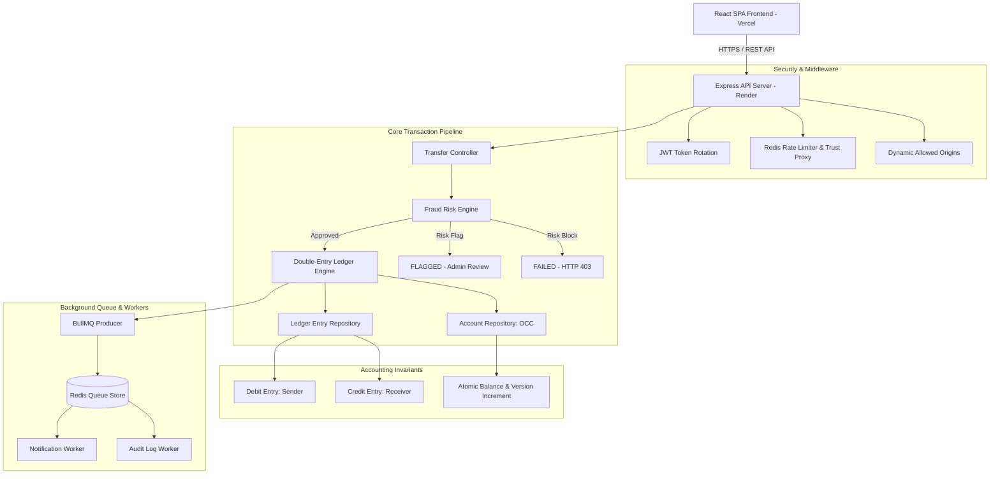

# Vetanam — Distributed Payment Ledger

Production-grade, highly available monetary transaction and double-entry accounting engine built with **Node.js, Express, MongoDB, Redis, BullMQ, and React (Vite & Light Fintech Design System)**.

[](LICENSE)
[]()
[]()

---

## 🌐 Live Demo & Deployment

| Component | Deployment Link | Description |
| :--- | :--- | :--- |
| **Frontend Application** | [vetanam-payment-ledger.vercel.app](https://vetanam-payment-ledger.vercel.app) | React SPA deployed on Vercel |
| **Backend API Service** | [vetanam-payment-ledger.onrender.com](https://vetanam-payment-ledger.onrender.com) | Express REST API deployed on Render |
| **Swagger API Docs** | [vetanam-payment-ledger.onrender.com/docs](https://vetanam-payment-ledger.onrender.com/docs) | Interactive Swagger UI Documentation |

### 🔑 Demo Account Credentials
* **Email**: `harshilrajyaguru22@gmail.com`
* **Password**: `Password123!` *(or register your own account)*

> 💡 **Try it out**: You can send money to the demo account (`harshilrajyaguru22@gmail.com`) to experience real-time transaction history, ledger updates, and notifications.

---

## ✨ Key Features

- **Secure Authentication**: JWT Access & Refresh token rotation with session invalidation on logout.
- **Wallet Management**: User balance tracking stored strictly in minor unit integers (paise/cents) to prevent rounding errors.
- **Add Funds (Deposit)**: Instant deposit flow supporting quick amount presets and simulated payment methods with zero-fee guarantees.
- **Peer-to-Peer Transfers**: Email-based recipient lookup allowing intuitive money transfers without raw database ObjectIDs.
- **Double-Entry Ledger Engine**: Guaranteed atomic DEBIT and CREDIT balance postings ensuring total debits equal total credits ($\sum \text{Debits} = \sum \text{Credits}$).
- **Fraud Prevention Engine**: Pre-ledger risk evaluation classifying transactions as `APPROVED`, `FLAGGED` (for admin review), or `BLOCKED`.
- **Real-time State Sync**: Automatic 10-second polling and window-focus listeners ensuring instant balance, transaction, and notification updates.
- **Background Workers**: Asynchronous notification delivery and audit logging powered by BullMQ queues and Redis.
- **Admin Portal**: Account freeze/unfreeze toggles, global transaction auditing, and manual risk review capabilities.
- **Swagger Documentation**: Interactive OpenAPI documentation served directly at `/docs`.

---

## 🏛️ System Architecture



---

## 💡 Architecture Highlights

* **Optimistic Concurrency Control (OCC)**: Account balance updates use manual `version` counter increments (`$inc: { version: 1 }`), preventing race conditions and double-spending without database lock contention.
* **Idempotent Transactions**: Every transfer request accepts an `Idempotency-Key` header with a 24-hour TTL window, preventing duplicate executions on network retries.
* **Distributed Ledger**: Every financial movement produces immutable DEBIT and CREDIT entries linked directly to the parent transaction ID for 100% auditability.
* **Background Job Processing**: Notification delivery and audit logging are offloaded asynchronously to BullMQ workers, maintaining sub-100ms API response times.
* **Redis Caching & Rate Limiting**: Distributed rate-limiting by IP and user identifier protects authentication and transfer endpoints against abuse.
* **MongoDB Multi-Document Safety**: Models enforce schema-level invariants, optimistic locking, and strict role authorization boundaries.

---

## 🚀 Tech Stack

* **Frontend**: React 18, Vite 5, React Router v6, Axios, Lucide Icons, Custom Light Fintech Design System.
* **Backend**: Node.js (ESM), Express.js, Mongoose 8, Pino Logger, Helmet, CORS, Swagger UI.
* **Databases & Queues**: MongoDB, Redis 7, BullMQ 5.
* **Testing & Tools**: Jest 29, Supertest, Vitest, ESLint, Docker & Docker Compose.

---

## 📂 Project Structure

```
.
├── backend/
│   ├── src/
│   │   ├── config/          # Database, Redis, BullMQ, Swagger configurations
│   │   ├── controllers/     # Express HTTP request handlers
│   │   ├── middlewares/     # Auth, Rate Limiter, Validation, Error handlers
│   │   ├── models/          # Mongoose Schemas (User, Account, Transaction, LedgerEntry, etc.)
│   │   ├── repositories/    # Database abstraction layer
│   │   ├── routes/          # API route definitions
│   │   ├── services/        # Core business & ledger logic
│   │   ├── utils/           # Helper utilities
│   │   └── workers/         # BullMQ queue processors
│   └── tests/               # Integration & unit test suite (77 passing tests)
├── frontend/
│   ├── src/
│   │   ├── components/      # UI components (BalanceCard, Navbar, Modals, Badges)
│   │   ├── pages/           # Pages (Dashboard, Transfer, History, Notifications, Admin)
│   │   ├── services/        # Axios API client & services
│   │   ├── store/           # AuthContext state management
│   │   └── utils/           # Currency formatting & helpers
│   └── vercel.json          # SPA routing rewrites configuration
└── docker-compose.yml       # Full stack local orchestration
```

---

## 📋 API Reference Summary

| Endpoint | Method | Access | Description |
| :--- | :--- | :--- | :--- |
| `/api/v1/auth/register` | `POST` | Public | Register new user & initialize wallet account |
| `/api/v1/auth/login` | `POST` | Public | Authenticate credentials & return Access/Refresh JWTs |
| `/api/v1/auth/refresh` | `POST` | Public | Rotate refresh token and issue new JWT pair |
| `/api/v1/auth/logout` | `POST` | User | Invalidate active refresh token session |
| `/api/v1/accounts/me` | `GET` | User | Fetch profile & wallet balance |
| `/api/v1/accounts/deposit` | `POST` | User | Deposit funds into wallet account |
| `/api/v1/transfers` | `POST` | User | P2P transfer money by email (Idempotency guarded) |
| `/api/v1/transactions` | `GET` | User | Fetch paginated transaction history |
| `/api/v1/transactions/:id` | `GET` | User | View single transaction details |
| `/api/v1/transactions/:id/ledger` | `GET` | User | View double-entry debit/credit ledger breakdown |
| `/api/v1/notifications` | `GET` | User | Fetch user notifications |
| `/api/v1/admin/users` | `GET` | Admin | List all registered system users & wallet balances |
| `/api/v1/admin/users/:id/freeze` | `PATCH` | Admin | Freeze or unfreeze target user account |
| `/api/v1/admin/transactions` | `GET` | Admin | Query global transactions with status/date filters |
| `/api/v1/admin/transactions/:id/review` | `PATCH` | Admin | Review FLAGGED transaction (Approve/Reject) |
| `/api/v1/admin/audit-logs` | `GET` | Admin | Query compliance audit log trail |
| `/health` | `GET` | Public | Infrastructure health check (MongoDB & Redis status) |
| `/docs` | `GET` | Public | Interactive Swagger API documentation |

---

## 🛠️ Local Development Setup

### 1. Clone & Install Dependencies
```bash
git clone https://github.com/harshilrajyaguru/vetanam-payment-ledger.git
cd vetanam-payment-ledger

# Install Backend
cd backend && npm install

# Install Frontend
cd ../frontend && npm install
```

### 2. Configure Environment Variables
```bash
# Backend (.env)
PORT=3000
MONGODB_URI=mongodb://localhost:27017/payment_ledger
REDIS_URL=redis://localhost:6379
JWT_ACCESS_SECRET=dev-access-secret
JWT_REFRESH_SECRET=dev-refresh-secret

# Frontend (.env)
VITE_API_BASE_URL=http://localhost:3000/api/v1
```

### 3. Launch via Docker Compose
```bash
docker compose up --build -d
```
Access local servers at:
* **Frontend**: `http://localhost:5173`
* **Backend API**: `http://localhost:3000`
* **Swagger UI**: `http://localhost:3000/docs`

---

## 🧪 Testing & Verification

Run the automated test suite across the backend:

```bash
# Run 77 backend integration & unit tests
cd backend && npm test

# Run code linters
cd backend && npm run lint
cd frontend && npm run lint

# Verify Frontend production build
cd frontend && npm run build
```

---

## 📄 License
This project is licensed under the MIT License.
