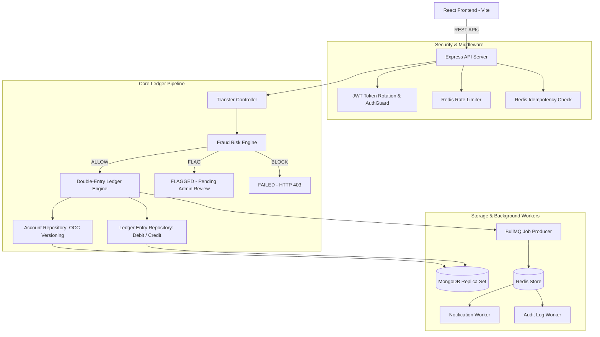

# Vetanam — Distributed Payment Ledger System

## Overview

Vetanam is a distributed payment ledger system built for reliable transaction processing, strict financial consistency, concurrency control, and request idempotency.

In modern payment and financial systems, processing concurrent transactions correctly is a critical challenge. Systems must guarantee balance integrity, prevent double-spending, eliminate duplicate transaction executions caused by network retries, and maintain an immutable, audit-ready record of every monetary movement.

Vetanam demonstrates these backend engineering principles through a production-grade simulated payment environment. It implements a double-entry accounting engine, optimistic concurrency control (OCC), header-based idempotency handling, rule-based fraud evaluation, and asynchronous queue worker processing.

---

## Key Features

The repository implements the following backend capabilities:

* **Double-entry accounting**: Every transaction atomically records corresponding DEBIT and CREDIT entries ($\sum \text{Debits} = \sum \text{Credits}$).
* **Atomic transaction processing**: Multi-document database operations execute within atomic MongoDB replica set transactions.
* **Idempotent payment requests**: Duplicate HTTP request prevention guarded by `Idempotency-Key` headers stored in Redis with a 24-hour TTL.
* **Concurrency control**: Optimistic Concurrency Control (OCC) using explicit version counter increments (`$inc: { version: 1 }`) to prevent race conditions during balance updates.
* **Balance consistency**: Balances are stored strictly as minor unit integers (paise/cents) to avoid floating-point rounding errors.
* **Asynchronous transaction processing**: Offloads post-ledger tasks like notification delivery and audit log persistence to Redis-backed BullMQ workers.
* **Redis-based caching & state management**: Distributed rate limiting, session revocation tracking, and idempotency key state caching.
* **Authentication**: JWT access and refresh token issuance with automatic rotation and session invalidation on logout.
* **Role-based access control (RBAC)**: Role checks distinguishing standard `user` actions from `admin` management and risk review endpoints.
* **Distributed rate limiting**: Middleware protecting login, registration, and transfer endpoints against brute-force attacks and abuse.
* **Immutable audit logs**: System events, administrative reviews, and fraud evaluations recorded to a compliance log trail.
* **Fraud detection**: Pre-ledger heuristic risk evaluation engine classifying transactions into `ALLOW`, `FLAG`, or `BLOCK` states.
* **REST APIs & OpenAPI/Swagger**: Standardized JSON REST API endpoints documented interactively via Swagger UI at `/docs`.
* **Automated testing**: Comprehensive unit and integration test suite covering ledger operations, auth flow, idempotency, and background workers.
* **Dockerized deployment**: Multi-container orchestration setup with Docker Compose for local development and integration testing.

---

## Architecture

The system is structured as a decoupled architecture consisting of a React Single Page Application frontend, an Express API application server, MongoDB for primary ledger persistence, Redis for caching, rate-limiting, and queue state, and BullMQ worker processes for asynchronous task processing.

```text
React Frontend (Vite)
       |
       | REST APIs (HTTPS / JSON)
       v
Express API Server
       |
       +------------------+------------------+
       |                  |                  |
       v                  v                  v
    MongoDB             Redis          BullMQ Queue
 (Replica Set)       (Rate Limit /     (Notifications /
   (Ledger)         Idempotency)         Audit Worker)
```

### Architecture Flowchart



---

## Technology Stack

### Backend
* **Runtime**: Node.js (ESM)
* **Framework**: Express.js
* **Data Modeling**: Mongoose 8
* **Validation**: Zod
* **Logging & Middleware**: Pino Logger, Pino HTTP, Helmet, CORS

### Database
* **Primary Database**: MongoDB 7.0 (configured with Replica Set `rs0` for multi-document ACID transactions)

### Caching / Queues / Distributed Systems
* **In-Memory Store**: Redis 7 (ioredis)
* **Queue Engine**: BullMQ 5

### Frontend
* **Framework**: React 18, Vite 5
* **Routing & Client**: React Router v6, Axios
* **UI & Styling**: Lucide Icons, Custom Light Fintech Design System

### Security
* **Authentication**: JWT (JSON Web Tokens) with Access & Refresh Token rotation
* **Password Hashing**: Bcryptjs
* **Authorization**: Role-Based Access Control (`user`, `admin`)
* **Headers & Limiting**: Helmet, Express Trust Proxy, Redis-backed Rate Limiter

### Testing & Tools
* **Test Runner**: Jest 29, Supertest
* **Linting & Formatting**: ESLint 9, Prettier

### DevOps & Documentation
* **Containerization**: Docker, Docker Compose
* **API Documentation**: Swagger UI, OpenAPI spec served at `/docs`

---

## Payment Ledger

Vetanam enforces a strict double-entry accounting model to guarantee monetary balance integrity. Under double-entry rules, every financial transaction must consist of balanced debit and credit entries.

```text
Payment Request
   |
   +----> Debit Entry  (Sender Account: Balance Decreases)
   |
   +----> Credit Entry (Receiver Account: Balance Increases)
```

### Accounting Invariant

For every posted transaction, the sum of debits must equal the sum of credits:

$$\sum \text{Debits} = \sum \text{Credits}$$

### Concrete Implementation Details

* **Minor Unit Storage**: All balances and transaction amounts are represented as 64-bit integer minor units (e.g., paise for INR, cents for USD). Storing `$10.50` as `1050` eliminates IEEE 754 floating-point rounding errors.
* **Atomic Double-Entry Posting**: In `ledger.service.js`, transfer execution starts a MongoDB session transaction. Debit and Credit `LedgerEntry` documents are created simultaneously with references to the parent `Transaction` ID.
* **Transaction Rollback**: If balance updates fail or an unexpected exception occurs during posting, the MongoDB multi-document transaction is aborted, marking the parent transaction as `FAILED` and leaving account balances untouched.

---

## Concurrency Control

To handle concurrent transfer requests targeting the same account without database locks, Vetanam employs Optimistic Concurrency Control (OCC).

### Implementation Approach

1. Each `Account` document includes an integer `version` field (defaulting to `0`).
2. When performing a balance mutation, the query explicitly matches both the account `_id` and the current `version`:
   ```javascript
   Account.findOneAndUpdate(
     { _id: accountId, version: currentVersion },
     { 
       $inc: { balance: amountDelta, version: 1 } 
     },
     { new: true, session }
   )
   ```
3. If a concurrent transaction modified the account balance in the interim, the `version` counter will have changed. The conditional update returns `null`, indicating a concurrent modification conflict.
4. The transaction aborts cleanly, preventing race conditions, lost updates, and double-spending.

---

## Idempotency

Network failures often lead clients to retry POST requests. Without idempotency handling, retrying a payment request could cause duplicate balance debits.

### Implementation Approach

1. Payment endpoints (`POST /api/v1/transfers`) require an `Idempotency-Key` HTTP header containing a unique UUID generated by the client.
2. The idempotency middleware checks Redis for the existence of `idempotency:<key>`:
   * **First Request**: The key is stored in Redis with state `IN_PROGRESS` and a TTL window of 24 hours.
   * **Concurrent Duplicate**: If a matching key with `IN_PROGRESS` status is received while processing, the request returns `409 IDEMPOTENCY_CONFLICT`.
   * **Retried Request**: Once completed, the final HTTP status code and response payload are cached in Redis under the idempotency key. Subsequent retries return the cached response immediately without re-executing ledger operations.

---

## Asynchronous Transaction Processing

Critical HTTP request-response flows should not block on non-essential downstream tasks like notification distribution or auditing.

```text
API Request
    ↓
Ledger Execution (Synchronous)
    ↓
Enqueue BullMQ Job
    ↓
Redis Queue Store
    ↓
BullMQ Worker Processes (Asynchronous)
    ├── Notification Worker -> Deliver Email / User Alert
    └── Audit Log Worker    -> Persist Compliance Trail
```

### Queue Processing Design

* **Notification Worker**: Consumes jobs from `notification-queue` to build and store user notification records asynchronously.
* **Audit Log Worker**: Consumes jobs from `audit-queue` to guarantee compliance audit log storage without increasing API latency.
* **Resilience**: Workers feature retry backoff mechanisms and exponential retry policies managed via BullMQ.

---

## Redis

Redis 7 serves as the distributed state and coordination engine across the backend infrastructure.

### Implemented Use Cases

* **Distributed Rate Limiting**: Tracks IP-based and user-based request counts across window frames (`rl:auth`, `rl:transfers`) to protect endpoints against brute-force attacks.
* **Idempotency Key Cache**: Stores request keys, status indicators (`IN_PROGRESS`, `COMPLETED`), and serialized response payloads with a 24-hour expiration TTL.
* **Session & Token Revocation**: Stores revoked refresh token IDs to enforce instant session termination on user logout or refresh token reuse detection.
* **BullMQ Queue Backend**: Stores pending jobs, delayed jobs, active worker locks, and dead-letter queue structures.

---

## Security

Security mechanisms enforce data safety, access control boundaries, and threat mitigation:

* **JWT Access & Refresh Token Rotation**: Issues short-lived access tokens alongside refresh tokens. Refreshing credentials invalidates the previous refresh token and issues a new pair.
* **Refresh Token Reuse Detection**: If a previously used refresh token is presented, the system detects potential token theft and revokes all active sessions for that user.
* **Role-Based Access Control (RBAC)**: Enforces role restrictions (`user` vs `admin`) via `roleGuard` middleware, securing administrative audit log queries, account freeze actions, and manual transaction risk reviews.
* **Password Hashing**: User passwords are hashed using `bcryptjs` with salt rounds prior to storage.
* **Security Headers**: `helmet` middleware configures HTTP headers (CSP, HSTS, X-Content-Type-Options).
* **Distributed Rate Limiting**: Redis-backed rate limiters safeguard authentication and transfer endpoints against abuse.
* **Compliance Audit Logging**: Tracks sensitive administrative actions and risk evaluations in an immutable audit trail.

---

## Fraud Detection

Vetanam incorporates a pre-ledger risk evaluation engine (`FraudService`) to evaluate transaction safety prior to ledger execution.

### Rule-Based Heuristics

The engine evaluates incoming transfer requests against deterministic risk rules:

1. **Account Status Check**: Rejects transfers involving frozen or blocked accounts immediately (Risk Score: `100`).
2. **High Transfer Amount Threshold**: Flags single transfers exceeding 100,000 minor units / ₹1,000 (Risk Score: `+40`).
3. **Velocity Limit**: Flags accounts attempting more than 5 transfers within 1 hour (Risk Score: `+40`).
4. **Daily Cumulative Volume**: Flags accounts exceeding 500,000 minor units / ₹5,000 in total 24-hour transfer volume (Risk Score: `+30`).

### Risk Classification & System Action

* **`ALLOW`** (Risk Score < 50): Transaction proceeds directly to the double-entry ledger engine.
* **`FLAG`** (Risk Score 50–79): Transaction is created with `FLAGGED` status and placed in the admin review queue without debiting balances.
* **`BLOCK`** (Risk Score ≥ 80): Transaction is rejected immediately with HTTP 403 Forbidden.

*Note: Deterministic backend logic and accounting invariants enforce transaction correctness. Fraud evaluation runs prior to ledger execution to categorize risk.*

---

## REST API

The backend exposes standardized REST API endpoints for authentication, account management, transfers, transaction history, notifications, and administration.

| Method | Endpoint | Access | Description |
| :--- | :--- | :--- | :--- |
| `GET` | `/health` | Public | Infrastructure health check (MongoDB & Redis ping status) |
| `GET` | `/docs` | Public | Interactive Swagger API documentation |
| `POST` | `/api/v1/auth/register` | Public | Register new user & initialize wallet account |
| `POST` | `/api/v1/auth/login` | Public | Authenticate credentials & return Access/Refresh JWT pair |
| `POST` | `/api/v1/auth/refresh` | Public | Rotate refresh token and issue new JWT pair |
| `POST` | `/api/v1/auth/logout` | Protected | Invalidate active refresh token session |
| `GET` | `/api/v1/accounts/me` | Protected | Fetch authenticated user profile & wallet account balance |
| `POST` | `/api/v1/accounts/deposit` | Protected | Deposit funds into authenticated user's wallet account |
| `POST` | `/api/v1/transfers` | Protected | Initiate P2P money transfer by recipient email (Idempotency guarded) |
| `GET` | `/api/v1/transactions` | Protected | Fetch paginated transaction history for caller |
| `GET` | `/api/v1/transactions/:id` | Protected | View single transaction details (owner only) |
| `GET` | `/api/v1/transactions/:id/ledger` | Protected | View double-entry debit/credit ledger breakdown for transaction owner |
| `GET` | `/api/v1/notifications` | Protected | Fetch user notifications |
| `GET` | `/api/v1/admin/users` | Admin | List all registered system users & wallet balances |
| `PATCH` | `/api/v1/admin/users/:id/freeze` | Admin | Freeze or unfreeze target user account |
| `GET` | `/api/v1/admin/transactions` | Admin | Query global transactions with status/date filters |
| `PATCH` | `/api/v1/admin/transactions/:id/review` | Admin | Review FLAGGED transaction (Approve/Reject) |
| `GET` | `/api/v1/admin/audit-logs` | Admin | Query compliance audit log trail |

Interactive OpenAPI documentation is generated and served at `/docs`.

---

## Testing

Automated unit and integration test suites cover critical backend functionality.

### Test Coverage

* **Unit Tests**: Test ledger service accounting logic, model schema validations, repository abstraction methods, fraud risk rule evaluation, and worker lifecycles.
* **Integration Tests**: Verify end-to-end HTTP flows using Supertest against MongoDB Memory Server / local MongoDB, including authentication token rotation, deposit limits, transfer idempotency key deduplication, OCC rollback handling, and admin authorization rules.

### Running Tests

```bash
# Execute Jest test suite across backend
cd backend
npm test

# Run integration tests specifically
npm run test:integration

# Run code style linter
npm run lint
```

---

## Load Testing

API performance verification can be conducted against local or staged environments using load testing tools such as **k6** or **Apache JMeter**.

### Key Test Scenarios

* **Concurrent Transfers**: Simulating parallel transfer requests between accounts to verify Optimistic Concurrency Control (OCC) conflict handling.
* **Idempotency Header Stress**: Sending rapid duplicate POST requests with identical `Idempotency-Key` headers to ensure zero duplicate ledger postings.
* **Rate Limiter Thresholds**: Verifying HTTP 429 rate limiting enforcement when request volumes exceed defined limits.

---

## Running Locally

### Prerequisites

* Node.js v18+
* Docker & Docker Compose

### 1. Clone Repository

```bash
git clone https://github.com/harshilrajyaguru/vetanam-payment-ledger.git
cd vetanam-payment-ledger
```

### 2. Install Dependencies

```bash
# Install backend dependencies
cd backend && npm install

# Install frontend dependencies
cd ../frontend && npm install
```

### 3. Environment Configuration

Copy example environment files and update values as needed:

```bash
# Backend (.env)
cp backend/.env.example backend/.env

# Frontend (.env)
cp frontend/.env.example frontend/.env
```

### 4. Start Infrastructure via Docker Compose

```bash
docker compose up --build -d
```

Services will be accessible at:

* **Frontend SPA**: `http://localhost:5173`
* **Backend API**: `http://localhost:3000`
* **Swagger Documentation**: `http://localhost:3000/docs`

---

## Environment Variables

### Backend Configuration (`backend/.env`)

```env
PORT=3000
NODE_ENV=development
MONGODB_URI=mongodb://localhost:27017/payment_ledger?replicaSet=rs0
REDIS_URL=redis://localhost:6379
JWT_ACCESS_SECRET=your_jwt_access_secret_here
JWT_REFRESH_SECRET=your_jwt_refresh_secret_here
JWT_ACCESS_EXPIRATION=15m
JWT_REFRESH_EXPIRATION=7d
CORS_ORIGIN=http://localhost:5173
```

### Frontend Configuration (`frontend/.env`)

```env
VITE_API_BASE_URL=http://localhost:3000/api/v1
```

---

## Project Structure

```text
vetanam-payment-ledger/
├── backend/
│   ├── src/
│   │   ├── config/          # Database, Redis, BullMQ, and Swagger configurations
│   │   ├── controllers/     # Express HTTP request handlers
│   │   ├── fraud/           # Fraud detection rules and constants
│   │   ├── middlewares/     # AuthGuard, RateLimiter, Idempotency, Validation, Error handlers
│   │   ├── models/          # Mongoose Schemas (User, Account, Transaction, LedgerEntry, AuditLog)
│   │   ├── queues/          # BullMQ queue producers
│   │   ├── repositories/    # Database repository abstraction layer
│   │   ├── routes/          # API route definitions
│   │   ├── services/        # Core ledger, transfer, and fraud business logic
│   │   ├── utils/           # Helper utilities
│   │   ├── validators/      # Zod validation schemas
│   │   ├── workers/         # BullMQ queue processors (Notification, Audit log)
│   │   ├── app.js           # Express app setup and middleware configuration
│   │   ├── server.js        # API HTTP server entry point
│   │   └── worker.js        # Background worker process entry point
│   ├── tests/
│   │   ├── integration/     # API integration tests (auth, transfers, admin, deposit)
│   │   └── unit/            # Service and model unit tests
│   ├── Dockerfile
│   ├── Dockerfile.dev
│   └── package.json
├── docker/
│   └── nginx.conf           # Reverse proxy configuration
├── frontend/
│   ├── src/
│   │   ├── components/      # Reusable UI components (BalanceCard, Modals, Navbar)
│   │   ├── pages/           # Application views (Dashboard, Transfer, History, Admin)
│   │   ├── services/        # Axios API client setup
│   │   └── store/           # Authentication state context
│   ├── Dockerfile.dev
│   └── package.json
├── docker-compose.yml       # Docker orchestration (MongoDB RS, Redis, API, Worker, Frontend, Nginx)
├── .env.example
└── README.md
```

---

## Engineering Concepts Demonstrated

Vetanam demonstrates several key software engineering and distributed systems principles:

* **Double-Entry Financial Accounting**: Atomic debit/credit transaction entries maintaining total debit equals total credit accounting invariants ($\sum \text{Debits} = \sum \text{Credits}$).
* **ACID Transactions**: Utilizing database transaction sessions for multi-document operations to prevent partial updates.
* **Optimistic Concurrency Control (OCC)**: Using document version matching (`$inc: { version: 1 }`) to handle concurrent balance updates safely without database lock contention.
* **Idempotent API Design**: Header-based request deduplication (`Idempotency-Key`) preventing duplicate processing during client retries.
* **Asynchronous Task Processing**: Decoupling non-critical tasks (notifications, audit logging) from HTTP response paths using queue producers and workers.
* **Distributed Caching & Rate Limiting**: In-memory Redis tracking for request limits, session revocations, and idempotency states.
* **Role-Based Authorization & Security**: Token-based authentication (JWT rotation), password hashing (Bcrypt), and endpoint protection guards.
* **Automated Testing & Containerization**: End-to-end unit and integration testing with Dockerized multi-service orchestration.

---

## License

This project is licensed under the MIT License.

