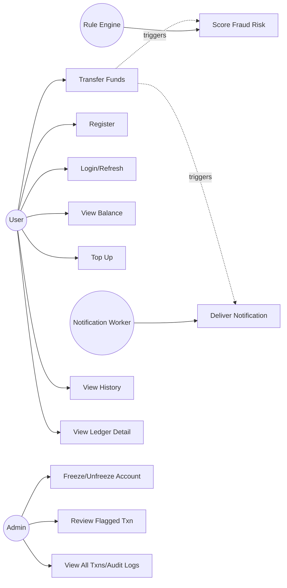
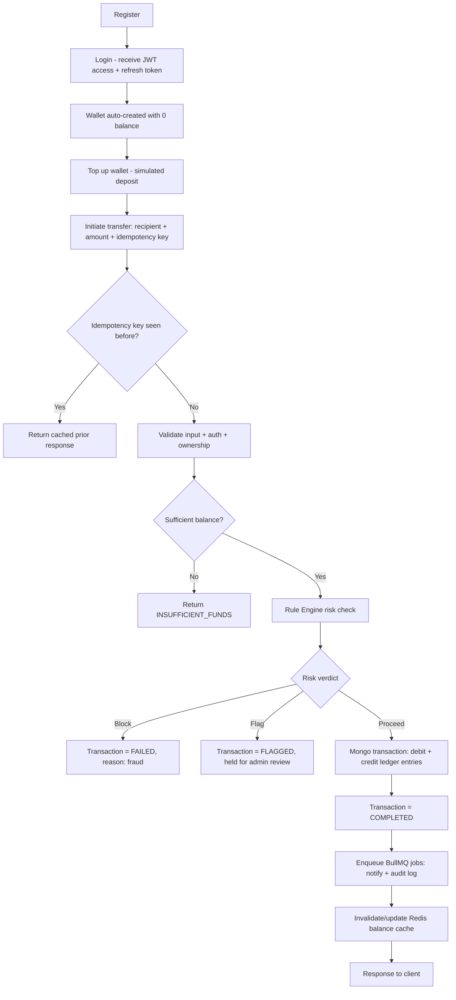
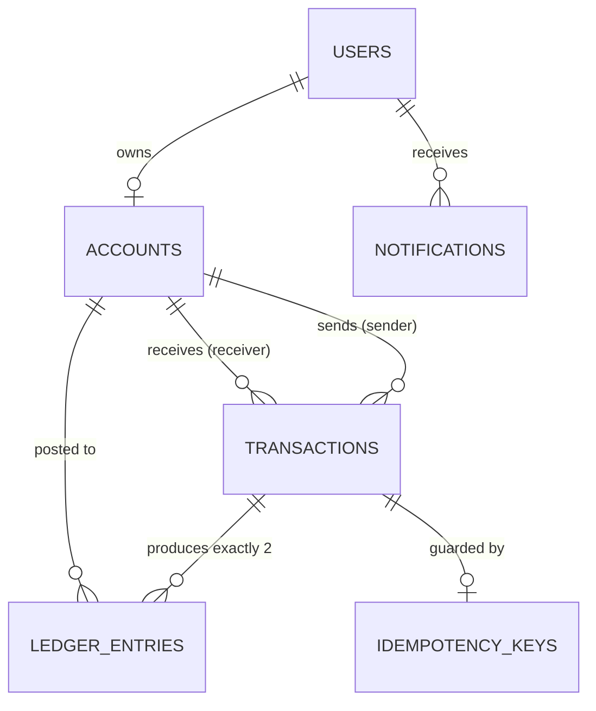
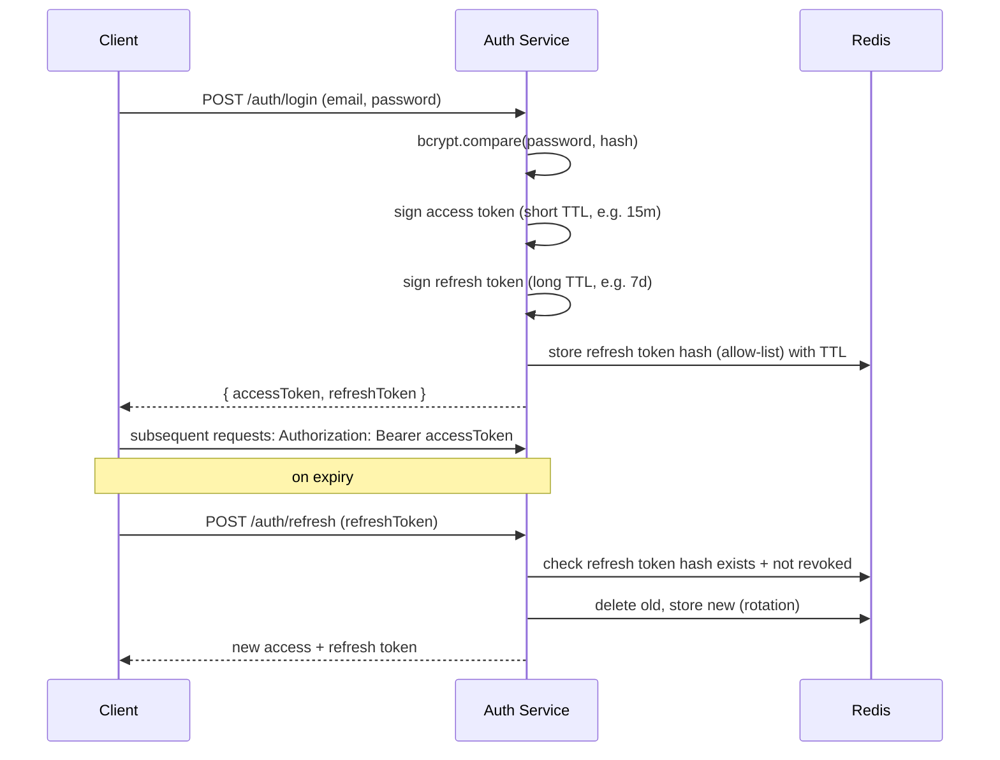
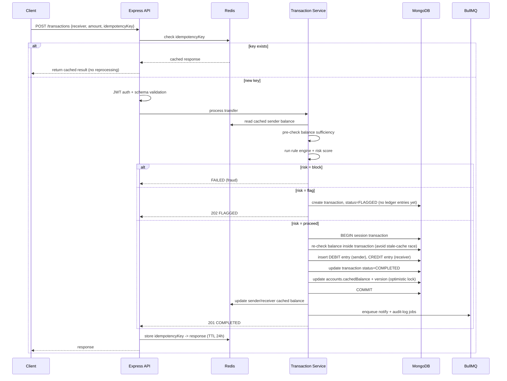
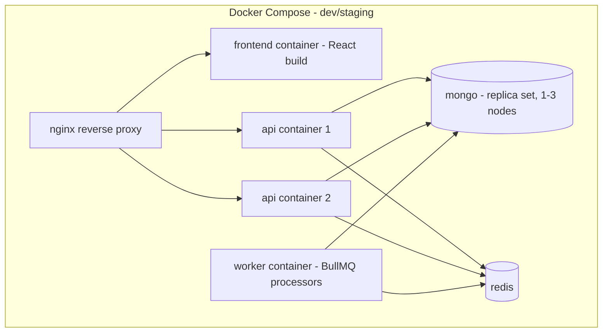

# Distributed Payment Ledger System — Phase 0 Architecture

**Stack:** React · Node.js · Express · MongoDB · Redis · BullMQ · JWT · Docker · Swagger
**Author role:** Principal Software Architect design pass (no implementation code)

> **Architect's note up front:** MongoDB for a double-entry ledger is a defensible choice (multi-document ACID transactions have existed since 4.0, and require a replica set — flagged in §20), but expect interviewers to push on "why not Postgres." Section 9 and Section 21 give you the real answer instead of "that's what the tutorial used." I've also folded in your fraud-detection flow (validate → rule engine → risk score → proceed/flag/block) as an optional differentiator, scoped so it doesn't inflate the project into an ML system.

---

## 1. Project Vision

### Problem Statement
Most resume "payment app" projects are CRUD wrappers — a `POST /pay` that decrements one balance field and increments another. That fails to demonstrate the real hard problems of payment systems: **concurrency** (simultaneous transfers corrupting balances), **consistency** (a crash mid-transfer creating or destroying money), **auditability** (no way to prove why a balance is what it is), and **idempotency** (a retried request double-charging a user).

### Why This Project Exists
| Reason | Explanation |
|---|---|
| Resume differentiation | Ledgers, idempotency, and queue-based processing are asked about in real backend/fintech interviews; a todo-app clone never touches this. |
| Interview depth | Every decision (double-entry, queue, cache) has a "why not the simpler alternative" answer — exactly what system-design interviews probe. |
| Systems thinking | Forces transactions, queues, caching, and failure handling — the actual job of a backend engineer, not just "connect React to an API." |

### Real-World Inspiration
- Double-entry ledgers used by Stripe, banking cores, and accounting-grade fintechs.
- Async settlement via queues, decoupling "accept the request" from "finish the side effects."
- Idempotency keys, the standard pattern for safe payment retries.
- Rule + risk-score triage, a simplified version of how gateways screen transactions before clearing.

### Scope
**In scope:** registration/auth, wallet-style accounts, double-entry ledger, P2P transfer with idempotency, async processing via BullMQ, Redis caching + rate limiting, admin visibility, transaction notifications, optional rule-based + risk-score fraud check.

**Out of scope:**
| Excluded | Why |
|---|---|
| Real PSP integration (live Stripe/Razorpay keys) | Internal ledger, not a payment processor — simulated top-up instead. |
| Regulatory compliance (PCI-DSS, KYC/AML) | No student project has the legal footing to claim this. |
| Trained ML fraud model | Rule-based + heuristic score only, explicitly not "real" ML. |
| Multi-currency/FX | Adds complexity (rate sourcing, rounding) disproportionate to resume value. |
| Blockchain | "Distributed" refers to system design (services/queues/cache), not a distributed ledger technology — worth saying explicitly in an interview. |
| Microservices at build time | Build modular monolith, designed to be split later (§21). |

---

## 2. Functional Requirements

### User Features
| Feature | Description |
|---|---|
| Register/Login | Email + password, JWT-based session |
| View wallet | See balance, currency, account status |
| Top-up wallet | Simulated deposit (no real PSP) |
| Transfer funds | Send money to another user by account ID/email |
| View transaction history | Paginated list of past transactions |
| View ledger detail | Drill into debit/credit entries for a transaction |
| Receive notifications | In-app/log notification on transaction completion/failure |

### Admin Features
| Feature | Description |
|---|---|
| View all users | Paginated, searchable |
| View all transactions | Filter by user, status, date range |
| Freeze/unfreeze account | Block a suspicious account from transacting |
| View flagged transactions | Transactions the fraud layer marked for review |
| Manually approve/reject flagged transaction | Admin override for `FLAGGED` state |
| View audit logs | Who changed what, when |

### Payment Features
| Feature | Description |
|---|---|
| Idempotent transfer initiation | Same request retried safely via idempotency key |
| Balance validation | Reject transfer if insufficient funds |
| Atomic debit/credit | Both ledger sides succeed or both roll back |
| Transaction status lifecycle | `PENDING → PROCESSING → COMPLETED / FAILED / FLAGGED / REVERSED` |

### Ledger Features
| Feature | Description |
|---|---|
| Double-entry posting | Every transaction produces a debit entry and a credit entry |
| Immutable entries | Ledger entries are never updated, only appended (corrections = new reversing entries) |
| Running balance derivation | Account balance = sum of ledger entries (cached, not the source of truth) |
| Transaction reference linking | Every ledger entry references its parent transaction |

### Authentication Features
| Feature | Description |
|---|---|
| Password hashing | bcrypt/argon2, never plaintext |
| JWT access + refresh tokens | Short-lived access token, longer-lived rotating refresh token |
| Role-based authorization | `user` vs `admin` |
| Session invalidation | Logout revokes refresh token |

### Notification Features
| Feature | Description |
|---|---|
| Transaction completed | Notify sender + receiver |
| Transaction failed/flagged | Notify sender with reason |
| Async delivery | Sent via BullMQ worker, not inline in the request |

---

## 3. Non-Functional Requirements

| Category | Requirement | How Achieved |
|---|---|---|
| **Security** | No plaintext secrets, protection from common web attacks | bcrypt hashing, JWT, Helmet, input validation, rate limiting (§17) |
| **Scalability** | Stateless API tier, horizontally scalable | No server-side session state; JWT + Redis for shared state; queue offloads heavy work |
| **Reliability** | No money created/destroyed even on crash | Mongo multi-document transactions for ledger writes; BullMQ retries + DLQ for side effects |
| **Performance** | Balance reads should not hit MongoDB on every request | Redis cache-aside for balance/account reads |
| **Maintainability** | Clear separation of concerns, testable in isolation | Layered architecture: Controller → Service → Repository (§7–8) |
| **Availability** | Core transfer path should degrade gracefully if a non-critical component (e.g., notification service) is down | Ledger write is synchronous/critical; notifications/fraud-scoring are async and queued, so their failure doesn't block a transfer |

---

## 4. Actors

| Actor | Type | Description |
|---|---|---|
| End User | Human | Registers, holds a wallet, sends/receives money |
| Admin | Human | Monitors system, freezes accounts, reviews flags |
| Auth Service | System (internal) | Issues/validates JWTs |
| Ledger Service | System (internal) | Owns the double-entry posting logic |
| Rule Engine / Risk Analyzer | System (internal, optional) | Scores a transfer's risk before it completes |
| Notification Worker | System (internal) | Consumes BullMQ jobs, delivers notifications |
| Scheduler/Cron | System (internal) | Periodic jobs — e.g., reconciling cached balances against ledger |

---

## 5. Use Cases

| # | Use Case | Primary Actor |
|---|---|---|
| UC1 | Register account | User |
| UC2 | Login / Refresh session | User |
| UC3 | View wallet balance | User |
| UC4 | Top up wallet | User |
| UC5 | Transfer funds to another user | User |
| UC6 | View transaction history | User |
| UC7 | View ledger entries for a transaction | User |
| UC8 | Freeze/unfreeze a user account | Admin |
| UC9 | Review flagged transaction | Admin |
| UC10 | View all transactions / audit logs | Admin |
| UC11 | Score a transfer for fraud risk | Rule Engine (system) |
| UC12 | Deliver transaction notification | Notification Worker (system) |

### Textual Use-Case Diagram



---

## 6. User Flow



---

## 7. High-Level Architecture

```mermaid
graph TD
    subgraph Client
        RC[React SPA]
    end

    subgraph API Tier - stateless, horizontally scalable
        EX[Express + Middleware<br/>Helmet, CORS, Rate Limiter, Auth Guard]
        CT[Controllers<br/>HTTP parsing, response shaping]
        SV[Services<br/>business rules, orchestration]
        RP[Repositories<br/>data access abstraction]
    end

    subgraph Async Tier
        BQ[BullMQ Queues]
        WK[Workers<br/>notification, audit-log, fraud-score]
    end

    subgraph Data Tier
        MG[(MongoDB<br/>replica set)]
        RD[(Redis)]
    end

    RC -->|HTTPS/REST| EX --> CT --> SV --> RP --> MG
    SV -->|cache-aside reads/writes| RD
    SV -->|enqueue jobs| BQ --> WK
    WK -->|write audit logs, read/update state| MG
    WK -->|rate-limit counters, idempotency keys| RD
```

**Where Redis fits:** cache-aside layer for account/balance reads, idempotency-key store, rate-limit counters, refresh-token allow-list. It is never the source of truth for money.

**Where BullMQ fits:** everything *after* the ledger is durably written — notification delivery, audit-log persistence, async fraud re-scoring for edge cases, email/webhook fan-out. The core debit/credit write stays synchronous inside a Mongo transaction, because eventual consistency is unacceptable for money movement itself.

---

## 8. Component Responsibilities

| Layer | Responsibility | Must NOT do |
|---|---|---|
| **Controller** | Parse HTTP request, validate shape (via schema), call service, shape HTTP response, map errors to status codes | Contain business logic, talk to the database directly |
| **Service** | Orchestrate business rules — balance checks, ledger posting, fraud check invocation, queue job creation | Know about `req`/`res`, know about Mongoose/HTTP specifics |
| **Repository** | Translate service intent into DB queries (Mongoose models), encapsulate schema details | Contain business rules (e.g., "is this transfer allowed") |
| **Middleware** | Cross-cutting concerns: auth, rate limiting, request logging, error formatting | Contain domain-specific logic |
| **Worker (BullMQ)** | Consume a job, perform one side effect, ack or fail-and-retry | Perform the primary ledger write (that already happened synchronously) |
| **Validator layer** | Schema validation (Joi/Zod) of every incoming payload | Business validation like "does this account have enough balance" |

---

## 9. Database Design

> All monetary amounts stored as **integers in minor units** (e.g., paise/cents), never floats — avoids binary floating-point rounding errors. This is a detail worth stating proactively in an interview.

### `users`
| Field | Type | Notes |
|---|---|---|
| `_id` | ObjectId | PK |
| `email` | String, unique, indexed | login identifier |
| `passwordHash` | String | bcrypt/argon2 hash |
| `role` | Enum `user`/`admin` | authorization |
| `status` | Enum `active`/`frozen` | admin can freeze |
| `createdAt`/`updatedAt` | Date | |

**Indexes:** unique index on `email`.
**Why it exists:** identity and auth boundary, separate from financial data — a user can be frozen without touching ledger integrity.

### `accounts`
| Field | Type | Notes |
|---|---|---|
| `_id` | ObjectId | PK |
| `userId` | ObjectId, indexed | ref → `users` |
| `currency` | String | e.g., `INR` (fixed for MVP) |
| `cachedBalance` | Integer (minor units) | **derived/denormalized**, reconciled from ledger |
| `version` | Integer | optimistic-concurrency counter |
| `status` | Enum `active`/`frozen` | |

**Relationships:** one user → one account (extensible to many later).
**Indexes:** index on `userId`.
**Validation:** `cachedBalance >= 0` enforced at the service layer before commit, not just schema-level.
**Why it exists:** fast balance reads without summing the entire ledger every time; `version` supports optimistic locking to prevent lost updates under concurrent transfers.

### `transactions`
| Field | Type | Notes |
|---|---|---|
| `_id` | ObjectId | PK, doubles as transaction reference |
| `senderAccountId` | ObjectId, indexed | |
| `receiverAccountId` | ObjectId, indexed | |
| `amount` | Integer (minor units) | |
| `status` | Enum `PENDING/PROCESSING/COMPLETED/FAILED/FLAGGED/REVERSED` | |
| `idempotencyKey` | String, unique, indexed | client-supplied |
| `riskScore` | Number 0–100, nullable | from rule engine |
| `failureReason` | String, nullable | |
| `createdAt`/`updatedAt` | Date | |

**Indexes:** unique index on `idempotencyKey`; compound index on `(senderAccountId, createdAt)` and `(receiverAccountId, createdAt)` for history queries.
**Why it exists:** the "intent" record — one transaction can map to exactly two ledger entries. Keeping transaction separate from ledger entries lets us track lifecycle/status without mutating immutable ledger rows.

### `ledger_entries`
| Field | Type | Notes |
|---|---|---|
| `_id` | ObjectId | PK |
| `transactionId` | ObjectId, indexed | ref → `transactions` |
| `accountId` | ObjectId, indexed | |
| `type` | Enum `DEBIT`/`CREDIT` | |
| `amount` | Integer (minor units) | always positive; sign implied by `type` |
| `balanceAfter` | Integer | snapshot, aids audit without recomputation |
| `createdAt` | Date | immutable — no `updatedAt` |

**Indexes:** compound `(accountId, createdAt)` for statement queries; index on `transactionId`.
**Validation:** application-enforced invariant — for every `transactionId`, sum(DEBIT) == sum(CREDIT).
**Why it exists:** this collection is the actual source of truth for money. `accounts.cachedBalance` is a performance optimization derived from this; if they ever disagree, the ledger wins.

### `idempotency_keys`
| Field | Type | Notes |
|---|---|---|
| `_id`/`key` | String, PK | client-supplied idempotency key |
| `requestHash` | String | hash of request body, detects key reuse with different payload |
| `responseSnapshot` | Object | cached response to replay |
| `status` | Enum `IN_PROGRESS`/`COMPLETED` | |
| `expiresAt` | Date, TTL indexed | e.g., 24h |

**Why it exists:** even though Redis holds a fast idempotency check (§14), this Mongo collection is the durable backstop so idempotency survives a Redis restart.

### `notifications`
| Field | Type | Notes |
|---|---|---|
| `_id` | ObjectId | |
| `userId` | ObjectId, indexed | |
| `transactionId` | ObjectId | |
| `type` | Enum `TXN_COMPLETED/TXN_FAILED/TXN_FLAGGED` | |
| `read` | Boolean | |
| `createdAt` | Date | |

**Why it exists:** decouples "a notification was generated" (fact) from delivery mechanism — a worker writes this row and optionally pushes it elsewhere.

### `audit_logs`
| Field | Type | Notes |
|---|---|---|
| `_id` | ObjectId | |
| `actorId` | ObjectId, nullable | null for system actions |
| `action` | String | e.g., `ACCOUNT_FROZEN`, `TXN_REVERSED` |
| `targetType`/`targetId` | String/ObjectId | polymorphic reference |
| `metadata` | Object | before/after snapshot |
| `createdAt` | Date | immutable |

**Why it exists:** compliance/traceability — answers "who did what, when" independent of application logs, which are rotated/discarded.

**Overall relationships (ER sketch):**



---

## 10. API Design

Unified base path: `/api/v1`. All responses follow the envelope in §16.

| Endpoint | Method | Auth | Description |
|---|---|---|---|
| `/auth/register` | POST | none | Create user + account |
| `/auth/login` | POST | none | Returns access + refresh token |
| `/auth/refresh` | POST | refresh token | Rotates refresh token, issues new access token |
| `/auth/logout` | POST | access token | Revokes refresh token |
| `/accounts/me` | GET | user | Current balance, status |
| `/transactions` | POST | user | Initiate a transfer (idempotency key required) |
| `/transactions` | GET | user | Paginated own transaction history |
| `/transactions/:id` | GET | user (owner) | Transaction detail |
| `/transactions/:id/ledger` | GET | user (owner) | Debit/credit entries for a transaction |
| `/notifications` | GET | user | List own notifications |
| `/admin/users` | GET | admin | Paginated user list |
| `/admin/users/:id/freeze` | PATCH | admin | Freeze/unfreeze |
| `/admin/transactions` | GET | admin | Filter by status/user/date |
| `/admin/transactions/:id/review` | PATCH | admin | Approve/reject a `FLAGGED` transaction |
| `/admin/audit-logs` | GET | admin | Paginated audit trail |

### Detailed spec — `POST /transactions` (the core endpoint)

**Request**
```json
{
  "receiverAccountId": "665f...",
  "amount": 50000,
  "idempotencyKey": "client-generated-uuid"
}
```

**Success response — 201**
```json
{
  "success": true,
  "data": {
    "transactionId": "665f...",
    "status": "COMPLETED",
    "amount": 50000,
    "senderBalanceAfter": 120000
  }
}
```

**Error responses**
| Status | Code | When |
|---|---|---|
| 400 | `VALIDATION_ERROR` | malformed body |
| 401 | `UNAUTHORIZED` | missing/invalid token |
| 403 | `ACCOUNT_FROZEN` | sender or receiver frozen |
| 404 | `RECEIVER_NOT_FOUND` | receiver account doesn't exist |
| 409 | `INSUFFICIENT_FUNDS` | balance check fails |
| 409 | `IDEMPOTENCY_KEY_CONFLICT` | same key, different payload |
| 422 | `TRANSFER_TO_SELF` | sender == receiver |
| 423 | `FLAGGED_FOR_REVIEW` | rule engine flagged (not an error exactly — 202 may be more correct, see note) |
| 429 | `RATE_LIMITED` | too many requests |
| 500 | `INTERNAL_ERROR` | unhandled |

> Note for the flagged case: returning `202 Accepted` with `status: "FLAGGED"` in the body is arguably more correct REST semantics than a 4xx, since the request was valid but the *outcome* is pending — worth defending either way in an interview, just be consistent.

*(Remaining endpoints follow the same envelope/status-code pattern; full Swagger/OpenAPI spec is the deliverable artifact for Phase 1 implementation, not duplicated here to avoid drift between two sources of truth.)*

---

## 11. Authentication Design

### JWT Flow


### Refresh Token Strategy
- **Rotating refresh tokens**: every refresh issues a new refresh token and invalidates the old one — if a stolen token is reused after rotation, it's detectable (reuse-detection → force logout of that session family).
- Stored **hashed** in Redis, keyed by `userId:tokenFamilyId`, with TTL matching expiry — Redis TTL does the cleanup for free.
- Access tokens are stateless (not stored) — validity is just signature + expiry check, which is what keeps the API tier stateless and horizontally scalable.

### Password Hashing
- bcrypt (cost factor 12) or argon2id — never MD5/SHA256 alone (too fast, brute-forceable).
- Hash + per-user salt (bcrypt/argon2 handle salting internally) — never a global pepper stored alongside the hash.

### Authorization
- Role check middleware (`user`/`admin`) at the route level.
- **Ownership check** at the service level: a user can only read/act on transactions/accounts where they are sender, receiver, or admin — this is separate from role and easy to forget, so it's called out explicitly.

---

## 12. Ledger Design

**Principle:** an account's balance is never stored as a single mutable number that gets incremented/decremented. It is *derived* from an append-only log of ledger entries. This is what "double-entry" means:

- **Debit entry** — money leaving an account (sender).
- **Credit entry** — money arriving at an account (receiver).
- Every transaction produces **exactly one debit and one credit**, both referencing the same `transactionId`.
- Invariant: `sum(debits for a transaction) == sum(credits for a transaction)`. Money is never created or destroyed — it only moves.

**Transaction Reference:** `transactions._id` is the anchor. Ledger entries never exist without a parent transaction; you can always answer "why does this balance look like this" by listing entries for an account and following each back to its transaction.

**Atomicity:** the debit entry, the credit entry, the transaction status update, and the account balance-cache updates must succeed or fail **together**. This requires a MongoDB **multi-document ACID transaction** (a `session` with `startTransaction()/commitTransaction()`), which in turn requires MongoDB to be deployed as a **replica set** — a standalone instance does not support this (flagged again in §20, easy to miss when spinning up a quick Docker container).

**Correction model:** if a completed transaction must be undone (e.g., fraud review later reverses it), we never delete or edit the original entries — we post a new **reversing transaction** with the debit/credit sides swapped. This preserves the immutable audit trail (you can see both the original mistake and its correction).

---

## 13. Money Transfer Flow



**Why the balance is re-checked *inside* the DB transaction, not just from Redis:** the Redis-cached balance is used only as a fast **pre-check** to fail fast on obviously-insufficient funds. The authoritative check happens inside the Mongo session against the real ledger-derived balance, because two concurrent transfers could both pass a stale cache check and overdraw the account — this is the classic **TOCTOU (time-of-check-to-time-of-use)** race, and it's exactly the kind of question an interviewer will ask.

---

## 14. Redis Design

### What should be cached
| Data | Why |
|---|---|
| `accounts.cachedBalance` (read path) | Avoids summing ledger entries on every balance read |
| Refresh token allow-list | Enables rotation + revocation without a DB round-trip |
| Rate-limit counters | Fixed-window/sliding-window counters, high write volume, ephemeral by nature |
| Idempotency key → response snapshot | Fast replay path (Mongo `idempotency_keys` is the durable backstop) |
| Session-adjacent lookups (e.g., "is this account frozen" flag) | Read-heavy, changes rarely |

### What should never be cached
| Data | Why |
|---|---|
| Ledger entries themselves | Source of truth must live in a durable, ACID-transactional store |
| The authoritative balance used for the debit decision | Must be read inside the Mongo transaction to avoid TOCTOU races (§13) |
| Password hashes / raw JWT secrets | Never belongs in a cache layer at all |
| Full transaction history pages long-term | Cache-aside with short TTL is fine; treating Redis as the paginated system-of-record risks staleness on a frequently-changing list |

### Idempotency Keys
- Redis key: `idem:{key}` → `{status, responseSnapshot}`, TTL 24h.
- `SET key value NX` (set-if-not-exists) atomically claims the key — this is what prevents two concurrent identical requests from both proceeding.
- Backed by the durable `idempotency_keys` Mongo collection so a Redis flush doesn't reopen a replay window.

### Rate Limiting
- Sliding-window counter per `userId` (or IP for unauthenticated routes) using Redis `INCR` + `EXPIRE`, or a sorted-set sliding-window for more precision.
- Applied at the middleware layer before hitting controllers — cheap rejection, protects downstream services.
- Stricter limits on `/transactions` and `/auth/login` (money movement + brute-force surface) than on read endpoints.

---

## 15. BullMQ Design

### Jobs
| Job | Trigger | Payload |
|---|---|---|
| `notify-transaction` | after transaction reaches a terminal status | `{transactionId, userId, type}` |
| `audit-log-write` | any admin action or transaction state change | `{actorId, action, targetId, metadata}` |
| `fraud-recheck` (optional) | transactions flagged for deeper async review | `{transactionId}` |
| `balance-reconciliation` | scheduled (cron-style repeatable job) | `{accountId}` — recomputes `cachedBalance` from `ledger_entries` and corrects drift |

### Retry Strategy
- Exponential backoff (e.g., `1s, 5s, 25s`) with a max of 3–5 attempts, configured per queue via BullMQ's `attempts` + `backoff` options.
- Jobs are **idempotent by design** (e.g., "mark notification as sent" checks current state before acting) so a retried job never double-sends.

### Dead Letter Queue
- Jobs exhausting retries move to a `failed` state (BullMQ tracks this natively); a separate monitoring job/admin endpoint surfaces failed jobs for manual inspection/requeue.
- Critical distinction: a job landing in DLQ (e.g., "notification failed to send") must **never** roll back the underlying ledger transaction — the money movement already committed. DLQ failures are about side effects, not correctness of the ledger.

### Worker Responsibilities
| Worker | Does | Does NOT |
|---|---|---|
| Notification worker | Writes `notifications` row, pushes to delivery channel | Touch ledger/account collections |
| Audit worker | Writes immutable `audit_logs` row | Perform any business decision |
| Reconciliation worker | Recomputes and corrects `accounts.cachedBalance` from ledger truth | Alter `ledger_entries` (immutable) |

---

## 16. Error Handling

### Unified Error Envelope
```json
{
  "success": false,
  "error": {
    "code": "INSUFFICIENT_FUNDS",
    "message": "Account does not have sufficient balance for this transfer.",
    "requestId": "req_9f21...",
    "timestamp": "2026-07-28T10:15:00Z",
    "details": {}
  }
}
```

### Business Error Catalog
| Code | HTTP Status | Meaning |
|---|---|---|
| `VALIDATION_ERROR` | 400 | Request body fails schema |
| `UNAUTHORIZED` | 401 | Missing/invalid/expired access token |
| `FORBIDDEN` | 403 | Valid token, insufficient role/ownership |
| `ACCOUNT_FROZEN` | 403 | Sender or receiver account frozen |
| `RECEIVER_NOT_FOUND` | 404 | No such account |
| `TRANSACTION_NOT_FOUND` | 404 | No such transaction / not owned by caller |
| `TRANSFER_TO_SELF` | 422 | Sender == receiver |
| `AMOUNT_INVALID` | 422 | Zero, negative, or non-integer minor-unit amount |
| `INSUFFICIENT_FUNDS` | 409 | Balance check fails |
| `IDEMPOTENCY_KEY_CONFLICT` | 409 | Key reused with a different payload |
| `FLAGGED_FOR_REVIEW` | 202 | Held pending admin review (not a true error) |
| `FRAUD_BLOCKED` | 403 | Rule engine hard-blocked the transfer |
| `RATE_LIMITED` | 429 | Too many requests in window |
| `INTERNAL_ERROR` | 500 | Unhandled exception |

---

## 17. Security

| Concern | Approach |
|---|---|
| **JWT** | Short-lived access tokens, signature verified via secret/asymmetric key, rotating refresh tokens (§11) |
| **Password Hashing** | bcrypt/argon2id, never reversible encryption |
| **Input Validation** | Schema validation (Joi/Zod) at the controller boundary, before any service logic runs |
| **Rate Limiting** | Redis-backed, per-user and per-IP, stricter on auth + transfer routes |
| **CORS** | Explicit allow-list of frontend origin(s), credentials handled deliberately (not `*` with credentials) |
| **Helmet** | Standard secure headers (CSP, HSTS, no-sniff, frame-guard) |
| **XSS** | React escapes output by default; additionally sanitize any user-generated text stored and later rendered (e.g., notification messages); CSP as defense-in-depth |
| **Injection Prevention** | Mongoose schema-typed queries (no raw `$where`/string-built queries), strict schema validation rejects unexpected operators in input objects (a real MongoDB-specific injection vector — e.g., a malicious `{"$gt": ""}` passed as a "password" field) |

---

## 18. Logging

| Log Type | Purpose | Storage | Contains |
|---|---|---|---|
| **Application Logs** | Operational visibility (requests, timings, warnings) | Structured JSON (pino/winston) → stdout → log aggregator | Request ID, route, latency, status code |
| **Error Logs** | Debugging failures | Same pipeline, `error` level, includes stack trace | Correlation/request ID to trace across services |
| **Audit Logs** | Compliance/traceability of state-changing actions | Dedicated `audit_logs` Mongo collection (§9), never rotated/discarded like app logs | Actor, action, target, before/after snapshot, timestamp |

**Key distinction:** application/error logs are operational and can be sampled/rotated/discarded; audit logs are a business record and must be durable, queryable, and immutable — that's why they live in their own collection rather than a log file.

---

## 19. Folder Structure

### Backend
```
backend/
├── src/
│   ├── config/            # env loading, db connection, redis connection
│   ├── middlewares/        # auth guard, rate limiter, error handler, request logger
│   ├── validators/         # Joi/Zod schemas per route
│   ├── routes/              # route → controller wiring
│   ├── controllers/         # HTTP layer only
│   ├── services/             # business logic (transaction, ledger, auth, fraud)
│   ├── repositories/          # Mongoose model access
│   ├── models/                 # Mongoose schemas
│   ├── queues/                  # BullMQ queue definitions
│   ├── workers/                   # BullMQ processors
│   ├── utils/                      # money math helpers, error classes
│   └── app.js / server.js
├── tests/
│   ├── unit/
│   └── integration/
├── Dockerfile
└── package.json
```

### Frontend
```
frontend/
├── src/
│   ├── components/         # reusable UI (Button, BalanceCard, TxnRow)
│   ├── pages/                # Login, Dashboard, TransferForm, History, AdminPanel
│   ├── hooks/                  # useAuth, useAccount, useTransactions
│   ├── services/                 # API client (axios instance, endpoint wrappers)
│   ├── store/                      # auth/session state (context or lightweight store)
│   ├── routes/                       # route guards (ProtectedRoute, AdminRoute)
│   └── utils/                          # formatting (minor units → display currency)
├── Dockerfile
└── package.json
```

---

## 20. Deployment



**Key points:**
- **MongoDB must run as a replica set**, even a single-node one (`rs.initiate()`), because multi-document transactions (the ledger write, §12) are unavailable on a standalone instance — this is the single most common setup mistake when demoing this project.
- API containers are stateless and can be scaled horizontally behind nginx/a load balancer; the worker container scales independently based on queue depth, not request volume.
- Separate `api` and `worker` containers (not one process doing both) so a slow/failing worker never starves the request-handling event loop.
- Environment-specific config via `.env` files / Docker secrets, never baked into images.
- Production evolution path: swap Docker Compose for Kubernetes, nginx for a managed load balancer, self-hosted Mongo/Redis for managed equivalents (Atlas/Elasticache) — worth mentioning as "next step," not built now.

---

## 21. Scalability Discussion

**Why MongoDB?**
Flexible schema suits evolving transaction metadata (e.g., adding `riskScore` later without a migration), and multi-document ACID transactions (since 4.0) make the ledger's atomicity requirement achievable. The honest trade-off: a relational database (Postgres) with foreign keys and `CHECK` constraints would enforce the double-entry invariant *at the schema level*, which Mongo cannot — here that invariant is enforced in the service layer instead. Worth acknowledging this trade-off directly rather than avoiding it.

**Why Redis?**
Sub-millisecond reads for the highest-frequency operation (balance lookups), and a natural fit for ephemeral, TTL-based data (idempotency keys, rate-limit counters, refresh-token allow-list) that shouldn't burden the primary datastore.

**Why BullMQ?**
Decouples the critical path (ledger write) from non-critical side effects (notifications, audit writes), backed by Redis, with built-in retry/backoff/DLQ semantics instead of hand-rolled queue logic.

**How would you scale to 1M users?**
- API tier: stateless, scale horizontally behind a load balancer.
- MongoDB: shard by `accountId`/`userId` once a single replica set's write throughput is the bottleneck; read replicas for admin/reporting queries.
- Redis: cluster mode for horizontal cache capacity.
- BullMQ: multiple worker instances consuming the same queue, partition queues by job type so a notification backlog can't starve audit-log processing.
- Hot accounts (e.g., a popular merchant account receiving thousands of transfers/second) become a write bottleneck regardless of sharding — mitigated by techniques like balance sharding/aggregation windows, which is a known hard problem worth naming rather than hand-waving.

**What are the bottlenecks?**
Single-account write contention (two transfers touching the same account serialize via optimistic locking/transaction retries), MongoDB write throughput on the ledger collection under high transaction volume, and queue backlog if worker capacity doesn't scale with job production rate.

**How would microservices change this architecture?**
Split along the natural service boundaries already implicit in the layered design: **Auth Service**, **Ledger Service** (owns `transactions`/`ledger_entries`, the only writer to money state), **Notification Service**, **Fraud/Risk Service**. Each gets its own datastore where reasonable, communicates via an API gateway for sync calls and an event bus (Kafka/RabbitMQ, BullMQ's Redis-based queues don't scale well as a cross-service event bus) for async. The trade-off: distributed transactions become much harder — the Ledger Service's atomicity is easy in one Mongo replica set, hard across service boundaries (would likely need a saga pattern). This is exactly why the project intentionally starts as a modular monolith.

---

## 22. Interview Preparation — 100 Questions

### Architecture & System Design (12)
1. Why layered architecture (Controller/Service/Repository) instead of putting logic directly in routes?
2. What's the difference between a Controller and a Service in your design?
3. Why is the API tier stateless, and why does that matter for scaling?
4. Why did you choose a modular monolith over microservices for this project?
5. What would force you to split this into microservices?
6. How does your architecture handle a partial failure (e.g., DB commit succeeds, queue enqueue fails)?
7. Where are the single points of failure in your current design?
8. How would you introduce an API gateway if this became multiple services?
9. What's the role of the Repository layer, and why not let Services call Mongoose directly?
10. How do you keep business logic testable without spinning up a real database?
11. What would you change if you had to support multiple currencies?
12. How does your design avoid tight coupling between the notification system and the payment flow?

### Database Design — MongoDB (12)
13. Why MongoDB instead of a relational database for a financial ledger?
14. What does MongoDB require to support multi-document ACID transactions?
15. Why is `accounts.cachedBalance` denormalized instead of always computing from `ledger_entries`?
16. How do you keep `cachedBalance` from drifting out of sync with the ledger?
17. Why store money as integers in minor units instead of floats?
18. What indexes did you create, and why each one specifically?
19. Why is `ledger_entries` append-only with no `updatedAt`?
20. How would you model this in a relational database instead, and what would you gain?
21. What's the risk of storing `senderAccountId`/`receiverAccountId` as unindexed fields?
22. How do you paginate transaction history efficiently at scale?
23. What happens to ledger correctness if a write silently partially fails?
24. How would sharding MongoDB affect your ability to run multi-document transactions?

### Ledger & Concurrency (12)
25. Explain double-entry accounting in your own words.
26. Why does a transfer produce two ledger entries instead of one?
27. What invariant must always hold across a transaction's ledger entries?
28. Walk through what happens if two transfers hit the same account at the same instant.
29. What is the TOCTOU race in your balance-check flow, and how do you prevent it?
30. Why is the authoritative balance check done inside the DB transaction, not from Redis?
31. What is optimistic locking, and how does your `version` field use it?
32. How do you reverse a completed transaction without deleting history?
33. What guarantees does a MongoDB session transaction give you that a normal write doesn't?
34. What happens if the process crashes mid-transaction — can money be duplicated or lost?
35. Why can't the ledger write be handled asynchronously via the queue?
36. How would you detect and repair a balance that has drifted from the ledger truth?

### Redis (10)
37. What's the difference between "source of truth" and "cache" in your design?
38. Why is the ledger never cached, but the balance is?
39. How does your idempotency-key mechanism actually prevent double-processing?
40. Why use `SET NX` for claiming an idempotency key?
41. What happens if Redis goes down mid-transfer?
42. How does rate limiting work under the hood (sliding window vs fixed window)?
43. Why store refresh tokens in Redis instead of just trusting the JWT signature?
44. What TTL strategy do you use for idempotency keys, and why that duration?
45. How would you scale Redis if a single instance became a bottleneck?
46. What data would you explicitly refuse to put in Redis, and why?

### BullMQ / Async Processing (10)
47. Why offload notifications to a queue instead of sending them inline in the request?
48. What's your retry strategy, and why exponential backoff specifically?
49. What happens to a job after it exhausts all retry attempts?
50. Why must a failed notification job never roll back the underlying transaction?
51. How do you make a queue worker idempotent?
52. What's the difference between a queue and a pub/sub event bus, and which did you use?
53. How would you monitor queue health/backlog in production?
54. Why is the ledger write synchronous while everything else is async?
55. How do you scale worker throughput independently from API throughput?
56. What would you do differently if BullMQ needed to become a cross-service event bus?

### Authentication & Security (12)
57. Walk through your JWT login flow end to end.
58. Why use both an access token and a refresh token instead of one long-lived token?
59. What is refresh token rotation, and what attack does it mitigate?
60. Why hash passwords with bcrypt/argon2 instead of SHA-256?
61. How do you invalidate a session on logout if JWTs are stateless?
62. What's the difference between authentication and authorization in your system?
63. How do you prevent a user from viewing another user's transaction by guessing an ID?
64. What is a NoSQL injection attack, and how does your schema validation prevent it?
65. Why use Helmet, and what specific header does it set that matters most here?
66. How does your CORS configuration prevent unauthorized origins from calling the API?
67. What's your strategy against brute-force login attempts?
68. If a refresh token is stolen, what's the blast radius, and how do you contain it?

### API Design (8)
69. Why did you choose a unified error envelope format?
70. Walk through the full request/response cycle of `POST /transactions`.
71. Why does a flagged transaction return 202 instead of a 4xx error?
72. How do you version your API, and why does that matter?
73. What status code do you return for insufficient funds, and why 409 instead of 400?
74. How would a client safely retry a failed transfer request?
75. Why require an idempotency key on the client side instead of generating one server-side?
76. How do you document this API so a frontend team can integrate without reading your code?

### Scalability & Performance (12)
77. Where is the first bottleneck if traffic grew 100x overnight?
78. How would you shard MongoDB for this system, and by what key?
79. What happens to your idempotency/rate-limiting layer if you scale Redis horizontally?
80. How do you keep the API tier stateless as you add more instances?
81. What's a "hot account" problem, and how does it break naive scaling assumptions?
82. How would caching strategy change under very high read-to-write ratios vs the reverse?
83. What would you monitor in production to catch a scaling problem before users notice?
84. How does horizontal scaling of workers interact with job ordering guarantees?
85. What's the cost of strong consistency (Mongo transactions) vs eventual consistency, and where did you choose each?
86. How would a CDN or edge caching layer fit into this architecture, if at all?
87. What load-testing approach would you use to validate this design before launch?
88. If MongoDB transactions became too slow under load, what's your fallback design?

### Fraud Detection / Risk (6)
89. Walk through your rule engine → risk score → proceed/flag/block flow.
90. Why is this explicitly not a "real" ML fraud model, and what would it take to become one?
91. What happens to a transaction while it's in the `FLAGGED` state — is the money moved or not?
92. Why run the risk check before the ledger write instead of after?
93. What rules would you actually implement first, and why those?
94. How would you avoid the fraud check becoming a performance bottleneck on every transfer?

### General / Behavioral Tie-In (6)
95. What was the hardest architectural decision in this project, and why?
96. If you rebuilt this today, what would you do differently?
97. What's a mistake you almost made in this design, and how did you catch it?
98. How did you decide what to explicitly leave out of scope?
99. How would you explain this project's value to a non-technical interviewer in two sentences?
100. What part of this project would you most want to demo live in an interview, and why?
